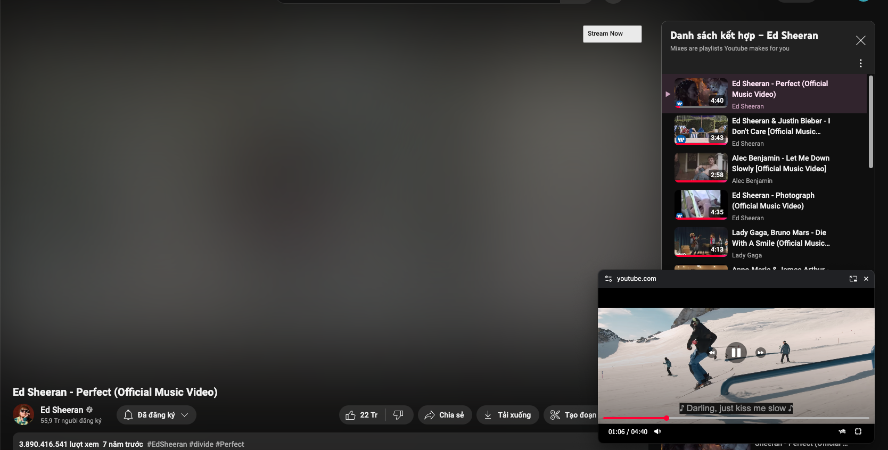

<h1 align="center">

PiP Master
</h1>

  

## Overview

This Chrome extension enhances the Picture-in-Picture (PIP) experience by adding advanced video controls. It allows
users to:

- Play/Pause the video
- Seek forward/backward
- Adjust volume
- Change playback speed
- Caption (Youtube)

Enjoy a more convenient and flexible way to control your videos while multitasking!

**Note:** Due to Chrome's policy restrictions, some videos embedded in iframes may not be controllable.

  

## License

[MIT](./LICENSE)

## Support me

